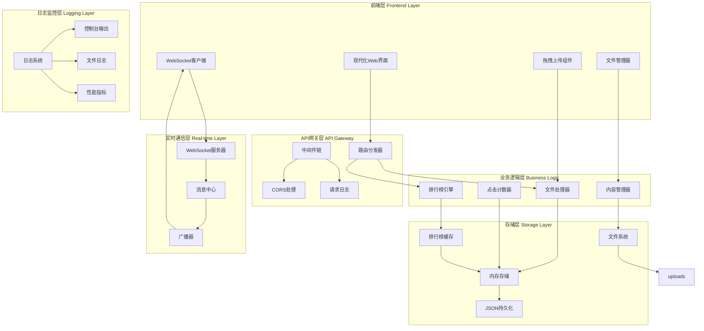
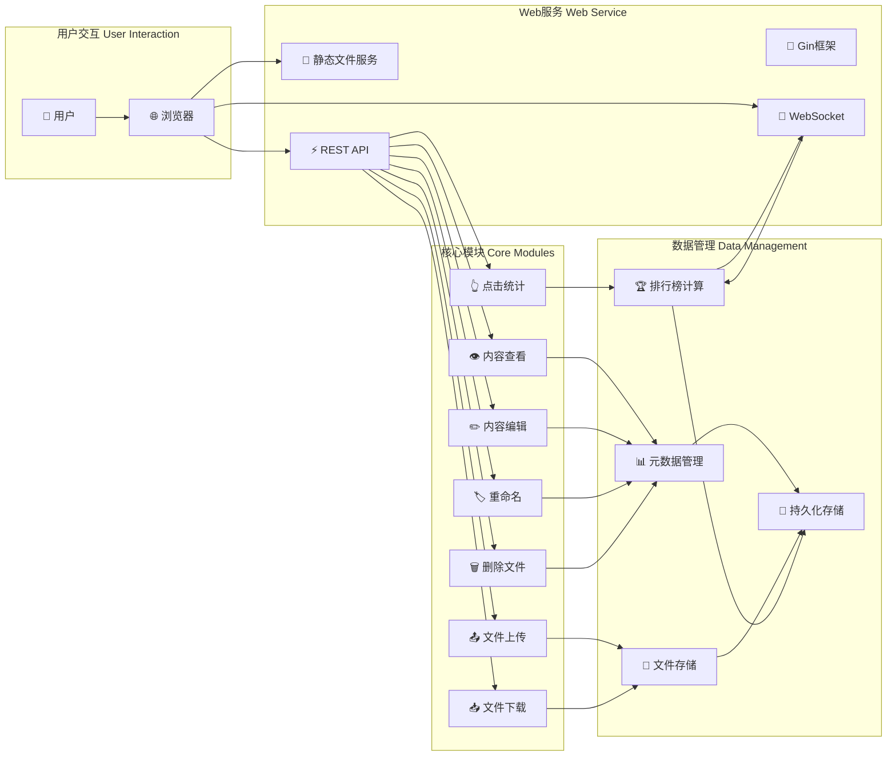
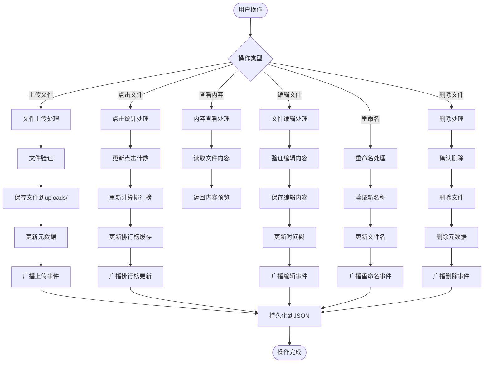
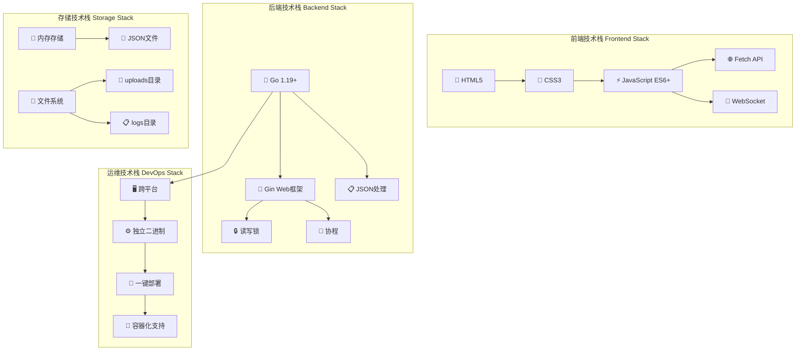
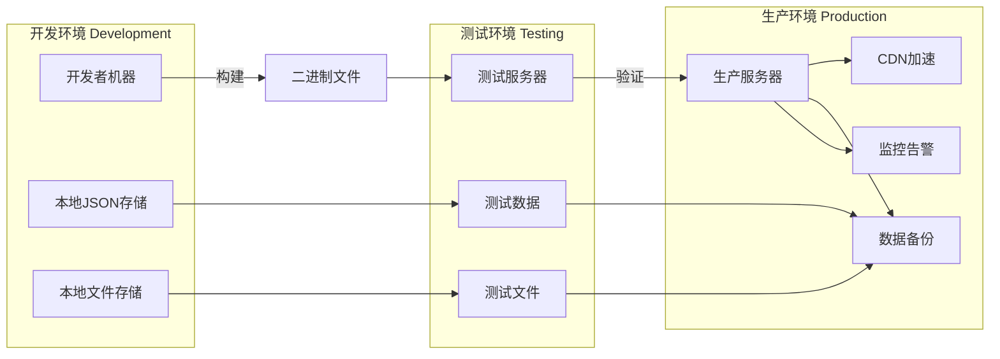
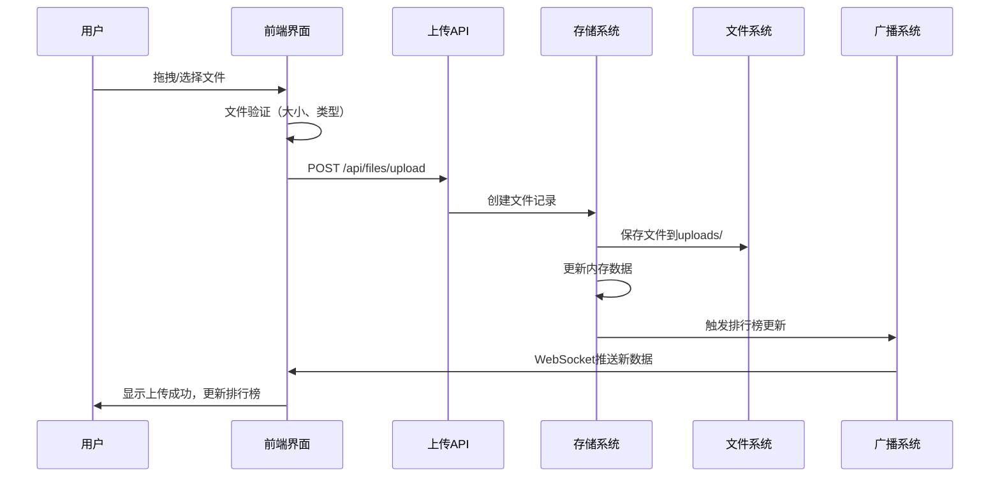
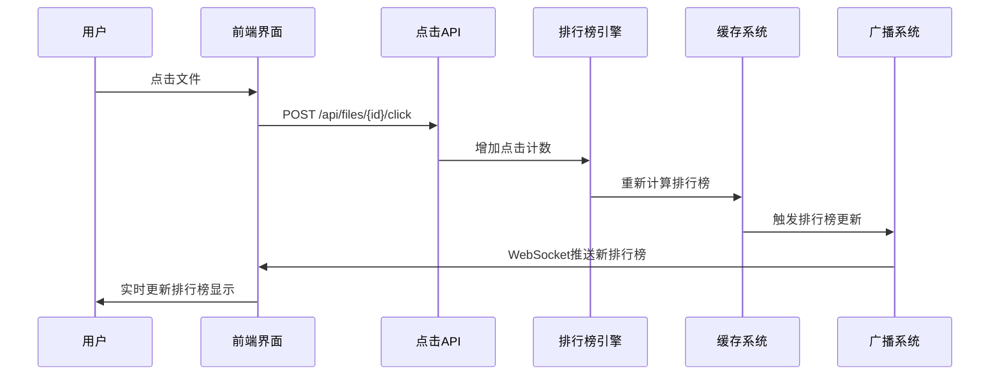
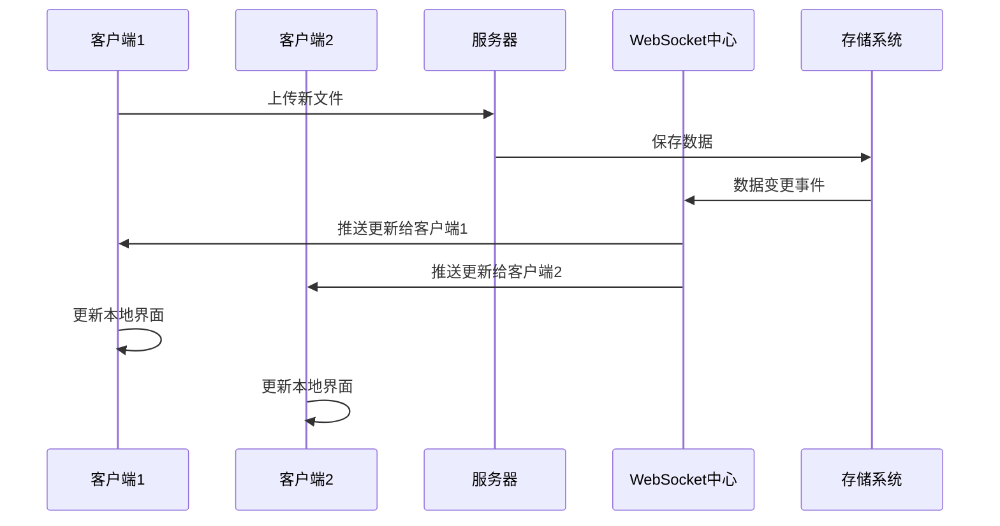
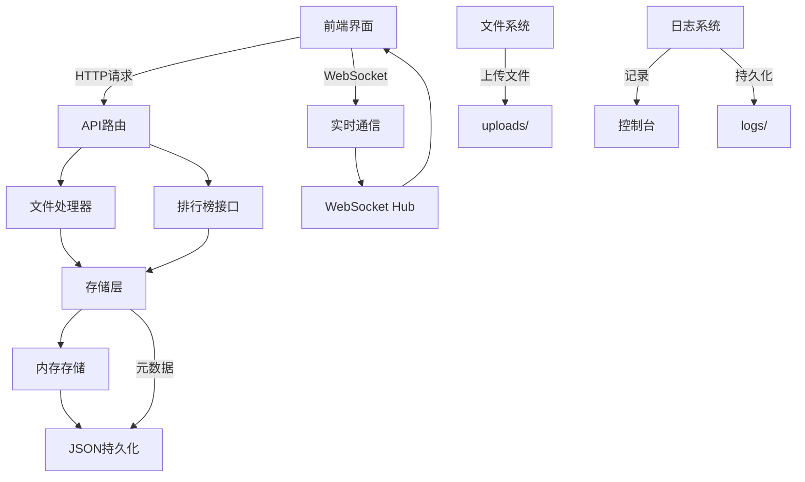
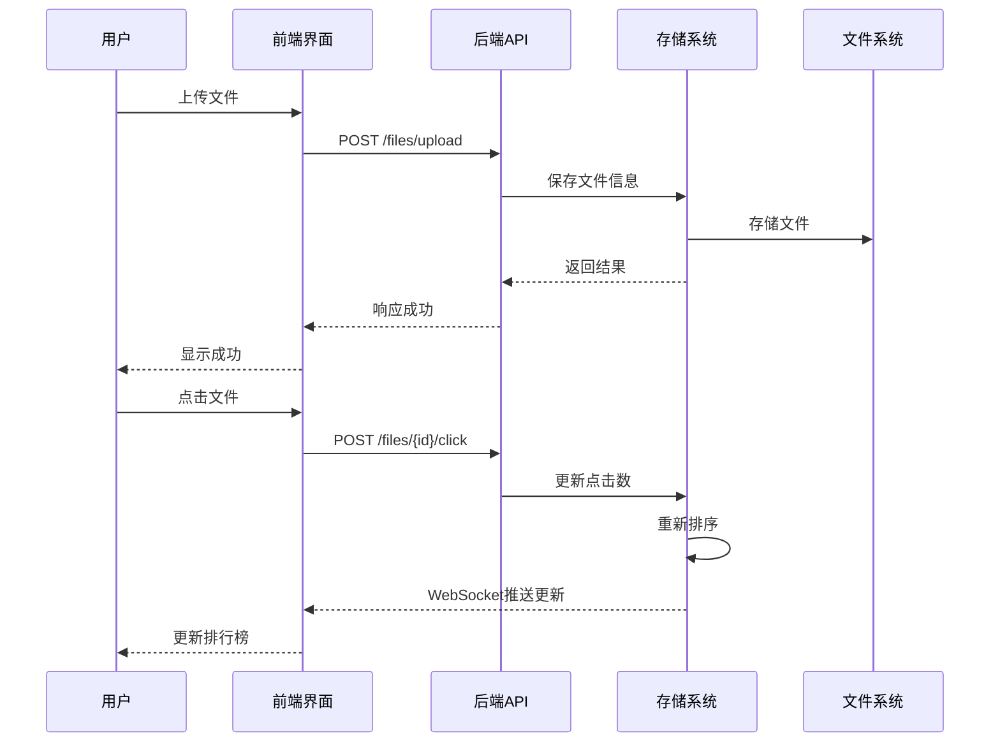

wendang # 文件点击排行榜系统

一个现代化的在线文件上传和点击排行榜系统，支持实时文件上传、下载和点击统计。

## 🎯 功能特性

- ✅ **在线文件上传**：支持拖拽上传和点击上传，支持任意格式文件
- ✅ **实时排行榜**：文件点击数实时更新，自动排序
- ✅ **文件下载**：支持在线下载已上传的文件
- ✅ **文件管理**：支持创建、重命名、删除、查看文件
- ✅ **文件内容查看**：在线预览文本文件内容，支持编辑跳转
- ✅ **内存存储**：高性能内存存储，支持快速查询
- ✅ **持久化**：自动保存到JSON文件，支持重启恢复
- ✅ **Web界面**：现代化响应式Web界面，支持深色模式
- ✅ **API接口**：完整的RESTful API支持
- ✅ **批量操作**：支持批量点击
- ✅ **实时更新**：WebSocket实时推送排行榜更新
- ✅ **错误处理**：完善的错误处理和日志记录
- ✅ **时间戳更新**：文件编辑后自动更新修改时间

## 🚀 快速开始

### 环境要求

- Go 1.19 或更高版本
- 现代浏览器（Chrome, Firefox, Safari, Edge）

### 安装和运行

1. **克隆项目**
   ```bash
   git clone <repository-url>
   cd file-ranking
   ```

2. **安装依赖**
   ```bash
   go mod tidy
   ```

3. **构建项目**
   ```bash
   go build -o file-ranking.exe cmd/main.go
   ```

4. **启动服务**
   ```bash
   ./file-ranking.exe
   ```

5. **访问系统**
   - Web界面: http://localhost:8080
   - API文档: http://localhost:8080/api/health

## 📊 API文档

### 基础API

#### 健康检查
```http
GET /api/health
```

#### 获取排行榜
```http
GET /api/ranking
```

### 文件管理API

#### 上传文件
```http
POST /api/files/upload
Content-Type: multipart/form-data

file: <binary-data>
```

#### 创建新文件
```http
POST /api/files/create
Content-Type: application/json

{
  "name": "文件名称",
  "content": "文件内容",
  "extension": ".txt"
}
```

#### 获取所有文件
```http
GET /api/files
```

#### 获取文件详情
```http
GET /api/files/{id}
```

#### 获取文件内容
```http
GET /api/files/{id}/content
```

#### 点击文件
```http
POST /api/files/{id}/click
```

#### 批量点击
```http
POST /api/files/click
Content-Type: application/json

{
  "doc_id": "file-id",
  "count": 5
}
```

#### 下载文件
```http
GET /api/files/{id}/download
```

#### 重命名文件
```http
PUT /api/files/{id}/rename
Content-Type: application/json

{
  "new_name": "新文件名称"
}
```

#### 编辑文件内容
```http
PUT /api/files/{id}/content/edit
Content-Type: application/json

{
  "content": "新的文件内容"
}
```

#### 查看文件内容
```http
GET /api/files/{id}/content
```

#### 删除文件
```http
DELETE /api/files/{id}
```

### WebSocket API

#### 实时数据更新
```http
GET /api/ws
```
连接WebSocket后，可以实时接收排行榜更新数据。

## 🎮 使用示例

### 1. 上传文件
- **拖拽上传**：将文件拖拽到上传区域，支持任意格式
- **点击上传**：点击上传区域选择文件，支持任意格式
- **多文件上传**：支持同时上传多个文件

### 2. 创建新文件
- **在线创建**：点击创建按钮，输入文件名称和内容
- **支持格式**：支持创建.txt、.md等文本格式文件
- **即时生效**：创建后立即出现在排行榜中

### 3. 查看排行榜
排行榜会自动排序，点击数最多的文件排在最前面。

### 4. 文件操作
- **点击**：增加文件点击数（单次点击或批量点击）
- **下载**：下载原始文件
- **重命名**：修改文件名称
- **删除**：从系统中移除文件
- **查看内容**：在线预览文本文件内容

### 5. 文件信息
每个文件显示：
- 文件名（可重命名）
- 文件大小
- 上传时间（编辑后自动更新）
- 点击次数
- 文件类型图标

### 6. 文件内容操作
- **查看内容**：点击"👁️ 查看"按钮在线预览文本文件
- **编辑内容**：在查看模式下点击"编辑"按钮直接修改文件内容
- **实时保存**：编辑后自动保存并更新时间戳

## ⚙️ 配置选项

### 端口配置
默认端口为8080，可以通过环境变量修改：
```bash
# Windows
set PORT=3000
# Linux/macOS
export PORT=3000
```

### 数据存储
- 文件元数据：保存在`data/files.json`
- 上传的文件：保存在`uploads/`目录
- 日志文件：保存在`logs/`目录

### 环境变量
- `PORT`: 服务器端口（默认: 8080）
- 系统会自动创建必要的目录（data、uploads、logs）

## 🔧 性能优化

- **内存存储**：所有数据存储在内存中，查询速度极快
- **快速排序**：使用优化的快速排序算法
- **缓存机制**：排行榜数据实时缓存，减少重复计算
- **WebSocket推送**：实时推送更新，减少轮询请求
- **增量更新**：仅更新变化的数据，提高响应速度

## 🆕 最新特性

### v2.0 新增功能
- **文件内容查看**：在线预览文本文件内容
- **文件内容编辑**：直接编辑文本文件并保存
- **时间戳自动更新**：编辑文件后自动更新修改时间
- **WebSocket实时更新**：排行榜变化实时推送到前端
- **深色模式支持**：现代化界面设计
- **响应式布局**：完美适配手机和桌面设备

### 技术升级
- **前端优化**：使用现代JavaScript ES6+特性
- **错误处理**：完善的错误提示和重试机制
- **性能提升**：减少不必要的API调用，提升用户体验
- **自动保存**：每5秒自动保存数据到磁盘
- **并发安全**：使用读写锁确保并发安全
- **文件大小限制**：单个文件最大10MB

## 🐛 异常处理

- **网络错误**：自动重试机制
- **文件错误**：详细的错误日志
- **数据恢复**：支持从备份文件恢复
- **文件验证**：上传前检查文件类型和大小

## 📱 界面功能

- **实时更新**：通过WebSocket实时推送排行榜更新，无需手动刷新
- **响应式设计**：支持手机、平板、电脑等各种屏幕尺寸
- **拖拽上传**：支持拖拽文件上传，提供视觉反馈
- **进度提示**：上传进度条和状态提示
- **错误提示**：友好的错误信息和重试机制
- **文件类型图标**：根据文件类型显示不同图标
- **批量操作**：支持批量点击增加计数
- **搜索过滤**：支持按文件名搜索过滤
- **排序功能**：支持按名称、大小、时间、点击数排序
- **主题适配**：支持明暗主题切换

## 🛠️ 技术栈

### 后端技术
- **语言**: Go 1.19+
- **框架**: Gin Web框架
- **实时通信**: WebSocket
- **日志**: 自定义日志系统（控制台+文件）
- **存储**: 
  - 内存存储（高性能读写）
  - JSON文件持久化
  - 文件系统存储（上传文件）

### 前端技术
- **基础**: HTML5 + CSS3 + JavaScript (ES6+)
- **通信**: WebSocket + Fetch API
- **样式**: 响应式CSS设计
- **图标**: 文件类型图标系统

### 部署环境
- **操作系统**: Windows、Linux、macOS
- **网络**: 支持本地部署和云部署
- **端口**: 可配置端口（默认8080）

## 📄 许可证

MIT License - 详见 [LICENSE](LICENSE) 文件

## 📁 项目文件结构

### 根目录结构

```
file-ranking/
├── cmd/                    # 主程序入口
│   └── main.go          # 应用程序入口点
├── internal/              # 内部包（不对外暴露）
│   ├── api/              # API处理层
│   │   ├── file_handlers.go
│   │   └── websocket.go
│   ├── logger/           # 日志模块
│   │   └── logger.go
│   └── storage/          # 数据存储层
│       └── file_store.go
├── web/                   # Web前端资源
│   ├── css/              # 样式文件
│   │   └── styles.css
│   ├── js/               # JavaScript文件
│   │   └── app.js
│   ├── assets/           # 静态资源（图片、图标等）
│   │   └── favicon.ico
│   └── index.html        # 主页面
├── data/                  # 数据文件
│   └── files.json   # 文件数据存储
├── uploads/               # 上传文件存储
├── logs/                  # 日志文件
├── README.md             # 项目说明文档
├── go.mod                # Go模块文件
├── go.sum                # Go依赖校验文件
```

### 前端资源组织

#### CSS 文件结构
- `web/css/styles.css` - 所有样式集中管理
- 采用模块化CSS设计，便于维护

#### JavaScript 文件结构
- `web/js/app.js` - 所有前端逻辑集中管理
- 功能模块化：上传、创建、删除、点击统计等

#### 静态资源
- `web/assets/` - 存放图标、图片等静态资源
- 便于CDN部署和缓存优化

### 代码组织原则

1. **关注点分离**：前端逻辑、样式、结构完全分离
2. **模块化设计**：每个功能模块独立维护
3. **易于扩展**：新增功能不影响现有结构
4. **维护友好**：文件命名清晰，结构直观

### 开发规范

- 前端文件统一使用小写字母和连字符命名
- JavaScript使用ES6+语法，模块化组织
- CSS使用BEM命名规范（可根据需要调整）
- 所有资源路径使用相对路径，便于部署

### 部署说明

新的结构支持：
- 静态文件服务（无需修改后端）
- CDN部署优化
- 前后端分离开发
- 容器化部署

### 兼容性

所有修改保持向后兼容：
- 原有API接口不变
- 功能逻辑完全一致
- 用户操作体验不变
- 仅优化项目结构和代码组织

## 🔄 系统架构图

### 整体架构图



### 组件交互图



### 数据流架构图



### 技术栈架构图



### 部署架构图



### 系统流程图

#### 1. 文件上传流程


#### 2. 点击统计流程


#### 3. 实时通信流程


### 详细架构图



### 数据流图

